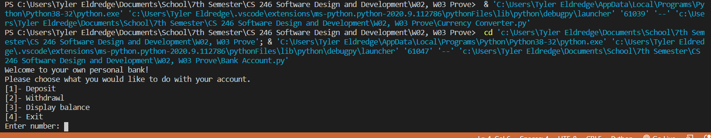

# Overview
My first Bank Account program that I have built using Python. 

# Development Environment

* Visual Studio Code
* Python 3.8.5

# Execution

To execute the Bank Account program: `python Bank_Account.py`

# Useful Websites

* [Python Refrence](https://docs.python.org/3/library/index.html)

